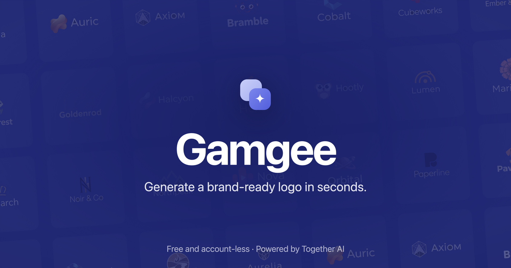

# Gamgee



Generate a logo, then export the whole brand kit around it. Runs in the browser,
just need a together.ai api key.

## What it does

- Describe a brand and get logos back in a handful of styles
- Upload a reference logo and have it read, then generate in that direction
- Download SVG, traced on-device: flat colours are posterized and despeckled
  before tracing, and real gradients come out as `linearGradient` fills rather
  than banded steps
- Export a brand kit: logo variants, favicon and app icons, social cards, merch
  mockups, a colour palette and a printable style guide
- Everything you make is kept on your device in IndexedDB

## Running it

You need a [Together AI](https://www.together.ai/) API key.

```bash
pnpm install
echo "TOGETHER_API_KEY=your-key" > .env.local
pnpm dev
```

Then open http://localhost:3000.

## Configuration

Everything else is optional and listed in `.env.example`: Upstash Redis for rate
limiting and the free-credit ledger, Clerk for sign-in, and `NEXT_PUBLIC_SITE_URL`
for the canonical URL and social card. Without Upstash and Clerk the app runs
account-less and visitors bring their own key.

## Stack

Next.js (App Router) and TypeScript, Tailwind with Radix primitives, FLUX on
Together AI for generation and editing.
